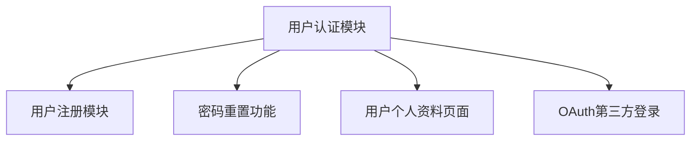

# Task Breakdown Skill

This skill guides senior architects through **Phase 3: Task Breakdown** of the collaborative workflow. It ensures granular, actionable task creation with clear dependencies, priorities, and acceptance criteria.

## When to Use

Use this skill when:
- Transitioning from technical design to implementation
- Planning sprints or releases
- Breaking down features into manageable work
- Assigning tasks to team members
- Creating project timelines
- Identifying dependencies and blockers

## How to Use

Invoke the skill by describing your implementation needs. The skill will:
1. **Analyze technical design** and extract work items
2. **Break down features** into granular tasks
3. **Define task details** with inputs, outputs, and dependencies
4. **Establish priorities** based on business value and risk
5. **Generate task list** in standardized format

## Task Granularity Rules

Each task should be:
- **Size**: ≤ 2 person-days of effort
- **Independent**: Can be completed without waiting for other tasks
- **Testable**: Has clear acceptance criteria
- **Valuable**: Delivers visible progress

### Good Tasks
- ✅ "Implement user authentication API endpoint"
- ✅ "Create database schema for orders table"
- ✅ "Add unit tests for payment processor"
- ✅ "Implement frontend login form"

### Bad Tasks
- ❌ "Build entire payment system" (too large)
- ❌ "Do some testing" (too vague)
- ❌ "Fix bugs" (no specific scope)

## Task Description Format

Each task follows this structure:

```markdown
[ ] Task Title

**描述**: 具体任务内容
**输入**: 任务所需输入项
**输出**: 预期结果
**依赖**: 关联的前置任务
**优先级**: High/Medium/Low
**估算**: X person-days
**验收标准**:
- 标准1
- 标准2
- 标准3
```

## Outputs Generated

The skill creates a comprehensive **Task List (开发任务.md)**:

```markdown
# 开发任务列表

## 项目信息
- **项目名称**: [项目名]
- **创建日期**: [日期]
- **版本**: v1.0

## 任务概览
- **总任务数**: N
- **已完成**: 0
- **进行中**: 0
- **待开始**: N
- **总估算**: X person-days

## 任务列表

### 阶段1: 核心功能 (优先级: High)

[ ] 任务1: 用户认证模块
  - **描述**: 实现账号密码登录功能
  - **输入**: 用户名、密码
  - **输出**: 登录token
  - **依赖**: 用户服务、认证服务
  - **优先级**: High
  - **估算**: 2 person-days
  - **验收标准**:
    - ✅ 支持用户名/密码验证
    - ✅ 返回JWT token
    - ✅ 密码加密存储
    - ✅ 登录失败处理
  - **状态**: 待开始
  - **负责人**: [待分配]

[ ] 任务2: 用户注册模块
  - **描述**: 实现新用户注册功能
  - **输入**: 邮箱、密码、用户名
  - **输出**: 注册成功确认
  - **依赖**: 用户认证模块
  - **优先级**: High
  - **估算**: 2 person-days
  - **验收标准**:
    - ✅ 邮箱格式验证
    - ✅ 密码强度检查
    - ✅ 邮箱唯一性检查
    - ✅ 发送确认邮件
  - **状态**: 待开始
  - **负责人**: [待分配]

### 阶段2: 辅助功能 (优先级: Medium)

[ ] 任务3: 密码重置功能
  - **描述**: 实现忘记密码重置流程
  - **输入**: 用户邮箱
  - **输出**: 密码重置链接
  - **依赖**: 用户认证模块
  - **优先级**: Medium
  - **估算**: 1.5 person-days
  - **验收标准**:
    - ✅ 邮箱验证
    - ✅ 生成重置token
    - ✅ 发送重置邮件
    - ✅ 重置密码验证
  - **状态**: 待开始
  - **负责人**: [待分配]

[ ] 任务4: 用户个人资料页面
  - **描述**: 创建用户个人资料管理页面
  - **输入**: 用户ID
  - **输出**: 资料更新界面
  - **依赖**: 用户认证模块
  - **优先级**: Medium
  - **估算**: 1 person-day
  - **验收标准**:
    - ✅ 显示用户信息
    - ✅ 支持信息编辑
    - ✅ 头像上传功能
    - ✅ 表单验证
  - **状态**: 待开始
  - **负责人**: [待分配]

### 阶段3: 扩展功能 (优先级: Low)

[ ] 任务5: OAuth第三方登录
  - **描述**: 支持Google/GitHub OAuth登录
  - **输入**: OAuth provider
  - **输出**: OAuth登录token
  - **依赖**: 用户认证模块
  - **优先级**: Low
  - **估算**: 2 person-days
  - **验收标准**:
    - ✅ Google OAuth集成
    - ✅ GitHub OAuth集成
    - ✅ 用户信息同步
    - ✅ 错误处理
  - **状态**: 待开始
  - **负责人**: [待分配]

## 依赖关系图



## 任务状态说明

- **待开始**: 任务已创建，等待分配和开始
- **进行中**: 任务正在执行中
- **待审核**: 任务已完成，等待代码审核
- **已完成**: 任务已完成并通过验收
- **已阻塞**: 任务因依赖未完成而阻塞
- **已取消**: 任务被取消

## 优先级说明

- **High**: 核心功能，必须在本次发布中完成
- **Medium**: 重要功能，计划在本次发布中完成
- **Low**: 增强功能，可以延期到后续版本

## 估算方法

### 1. 经验类比法
- 参考类似任务的完成时间
- 考虑复杂度差异

### 2. 三点估算法
- 乐观时间 (O)
- 最可能时间 (M)
- 悲观时间 (P)
- 估算 = (O + 4M + P) / 6

### 3. 功能点法
- 计算功能点数量
- 转换为人天数

## 依赖管理

### 依赖类型
1. **技术依赖**: 需要先完成的技术基础
2. **业务依赖**: 需要先完成的业务功能
3. **资源依赖**: 需要外部资源或工具
4. **任务依赖**: 需要其他任务完成

### 依赖处理策略
- **并行执行**: 无依赖或依赖已完成
- **串行执行**: 有前置依赖
- **重叠执行**: 部分依赖可并行

## 工作量分布

```
核心功能: ████████████ 60% (6 person-days)
辅助功能: ████████ 40% (4 person-days)
扩展功能: █████ 25% (2.5 person-days)
------------------------------------
总计: ████████████████████████████████ 12.5 person-days
```

## 风险评估

| 任务 | 风险类型 | 风险等级 | 应对措施 |
|------|----------|----------|----------|
| 用户认证模块 | 技术复杂度 | Medium | 提前验证技术方案 |
| OAuth集成 | 外部依赖 | High | 准备备用方案 |
| 密码重置 | 安全风险 | High | 安全审计 |

## 验收标准模板

### 功能验收
- [ ] 功能按需求正常工作
- [ ] 所有用户场景测试通过
- [ ] 边界条件处理正确
- [ ] 错误信息友好明确

### 质量验收
- [ ] 代码符合规范
- [ ] 测试覆盖率 ≥ 80%
- [ ] 无严重代码异味
- [ ] 性能符合要求

### 文档验收
- [ ] API文档完整
- [ ] 代码注释清晰
- [ ] 部署文档更新
- [ ] 用户文档同步

## 任务跟踪

### 状态更新频率
- **每日**: 更新进行中任务状态
- **每周**: 回顾完成情况，调整计划
- **里程碑**: 评估整体进度

### 进度报告模板
```markdown
## 第X周进度报告

### 完成情况
- 已完成任务: 3/10
- 完成率: 30%
- 本周完成: 任务1, 任务2, 任务3

### 进行中任务
- 任务4: 50%完成，预计完成时间 [日期]
- 任务5: 30%完成，预计完成时间 [日期]

### 阻塞任务
- 任务6: 等待任务4完成

### 风险与问题
- [问题描述] - [应对措施]

### 下周计划
- [计划任务]
```

## Best Practices

1. **Break it down** - If task > 2 days, break it down
2. **Define done** - Clear acceptance criteria for each task
3. **Track dependencies** - Map task relationships
4. **Update regularly** - Keep status current
5. **Communicate blockers** - Escalate issues early
6. **Re-estimate** - Adjust estimates based on actuals

## Examples

### Example 1: E-commerce Checkout
```
"Break down tasks for checkout feature"

The skill will create:
- Cart validation (0.5 days)
- Shipping address form (1 day)
- Payment method selection (1 day)
- Order summary page (1 day)
- Order confirmation (0.5 day)
- Email notification (0.5 day)
- Integration tests (1 day)
```

### Example 2: API Development
```
"Break down tasks for REST API"

The skill will create:
- API design and documentation (0.5 day)
- Database models (1 day)
- CRUD endpoints (2 days)
- Validation and error handling (1 day)
- Authentication middleware (0.5 day)
- Unit tests (1 day)
- Integration tests (1 day)
```

## Task Prioritization Matrix

| Quadrant | Description | Priority |
|----------|-------------|----------|
| High Value, Low Effort | Quick wins | **High** |
| High Value, High Effort | Major projects | **High** |
| Low Value, Low Effort | Fill-ins | **Low** |
| Low Value, High Effort | Thankless tasks | **Low** |

## Next Steps

After completing task breakdown:
1. Review task list for completeness
2. Assign tasks to team members
3. Set sprint start date
4. Proceed to **Phase 4: Feature Development**
5. Use Feature Development Skill for implementation guidance

---

**Remember**: Good task breakdown is the key to predictable delivery and successful project execution.
