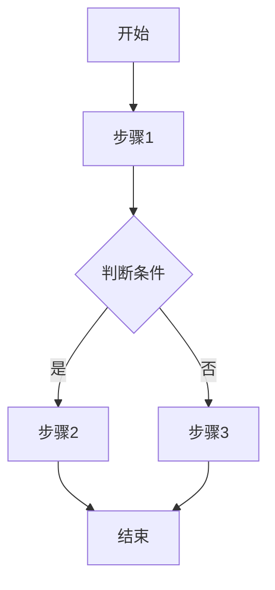
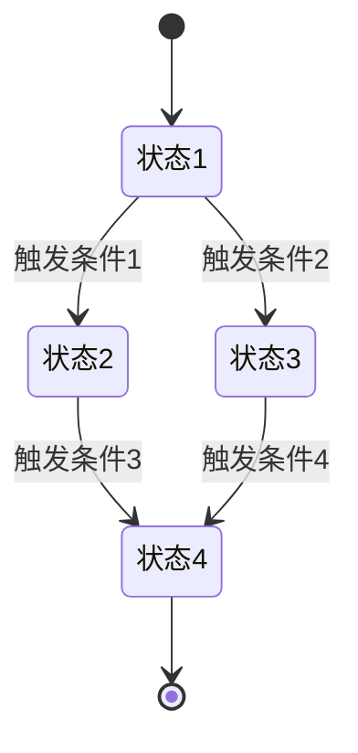
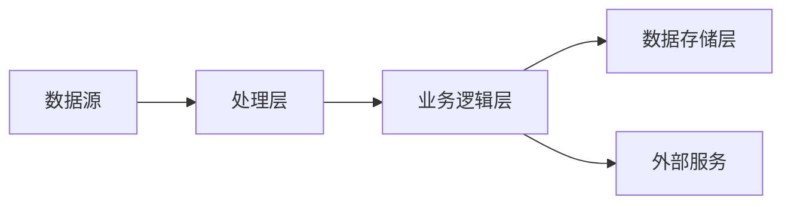
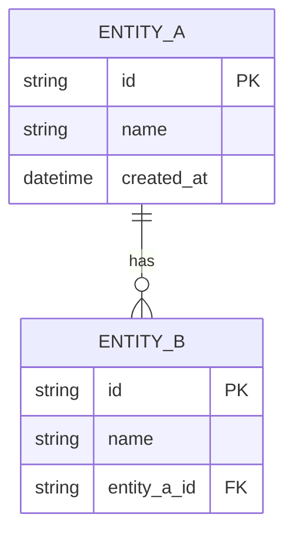

# 技术方案设计文档

## 项目信息
- **项目名称**: [项目名称]
- **创建日期**: [YYYY-MM-DD]
- **版本**: v1.0
- **负责人**: [姓名]

---

## 1. 需求基础

### 1.1 需求详情

#### 核心需求描述
[参考需求分析文档，简要描述核心需求]

#### 需求目的
[描述技术设计要解决的技术问题和目标]

#### 历史业务逻辑
[可选: 描述关联的过往逻辑和系统]

### 1.2 技术约束

- [ ] 技术栈限制: [具体限制]
- [ ] 性能要求: [具体要求]
- [ ] 安全要求: [具体要求]
- [ ] 合规要求: [具体要求]

---

## 2. 技术方案

### 2.1 业务逻辑

#### 核心业务流程


#### 状态转换图


#### 数据流图


### 2.2 架构设计

#### 2.2.1 整体架构

```
┌─────────────────────────────────────────────────────────┐
│                   客户端层 (Client Layer)                │
├─────────────────────────────────────────────────────────┤
│  Web前端  │  移动端  │  第三方集成  │  API客户端         │
└─────────────────────┬───────────────────────────────────┘
                      │
┌─────────────────────▼───────────────────────────────────┐
│                 接入层 (Gateway Layer)                   │
│  API网关  │  负载均衡  │  限流熔断  │  认证鉴权         │
└─────────────────────┬───────────────────────────────────┘
                      │
┌─────────────────────▼───────────────────────────────────┐
│                业务层 (Business Layer)                   │
│  服务A  │  服务B  │  服务C  │  服务D  │  服务E          │
└─────────────────────┬───────────────────────────────────┘
                      │
┌─────────────────────▼───────────────────────────────────┐
│               数据层 (Data Layer)                        │
│  关系数据库  │  缓存  │  消息队列  │  文件存储         │
└─────────────────────────────────────────────────────────┘
```

#### 2.2.2 分层设计

| 层级 | 职责 | 技术选择 | 备注 |
|------|------|----------|------|
| 表现层 | 用户界面和交互 | [技术栈] | [描述] |
| 业务层 | 业务逻辑处理 | [技术栈] | [描述] |
| 数据层 | 数据持久化 | [技术栈] | [描述] |
| 基础层 | 基础设施服务 | [技术栈] | [描述] |

#### 2.2.3 模块划分

```
project/
├── client/                 # 客户端模块
│   ├── web/               # Web前端
│   ├── mobile/            # 移动端
│   └── shared/            # 共享代码
├── gateway/               # API网关模块
│   ├── routing/           # 路由配置
│   ├── auth/              # 认证授权
│   └── middleware/        # 中间件
├── services/              # 业务服务模块
│   ├── service-a/         # 服务A
│   ├── service-b/         # 服务B
│   └── shared/            # 共享服务
├── infrastructure/        # 基础设施模块
│   ├── database/          # 数据库
│   ├── cache/             # 缓存
│   └── message-queue/     # 消息队列
└── docs/                  # 文档
```

#### 2.2.4 组件职责

| 组件 | 职责 | 输入 | 输出 | 依赖 |
|------|------|------|------|------|
| [组件名] | [职责描述] | [输入数据] | [输出数据] | [依赖组件] |

### 2.3 关键技术选择

#### 2.3.1 技术栈

**后端技术选择**
- [ ] **编程语言**: [语言] - 理由: [理由]
- [ ] **Web框架**: [框架] - 理由: [理由]
- [ ] **ORM/数据库访问**: [工具] - 理由: [理由]
- [ ] **缓存**: [工具] - 理由: [理由]
- [ ] **消息队列**: [工具] - 理由: [理由]

**前端技术选择**
- [ ] **框架**: [框架] - 理由: [理由]
- [ ] **状态管理**: [工具] - 理由: [理由]
- [ ] **UI组件库**: [库] - 理由: [理由]
- [ ] **构建工具**: [工具] - 理由: [理由]

**数据库选择**
- [ ] **主数据库**: [数据库] - 理由: [理由]
- [ ] **缓存数据库**: [数据库] - 理由: [理由]
- [ ] **搜索引擎**: [工具] - 理由: [理由]

#### 2.3.2 框架与工具

| 类别 | 工具 | 版本 | 用途 |
|------|------|------|------|
| 开发框架 | [框架名] | [版本] | [用途] |
| 测试框架 | [框架名] | [版本] | [用途] |
| 监控工具 | [工具名] | [版本] | [用途] |
| 部署工具 | [工具名] | [版本] | [用途] |

### 2.4 伪代码

#### 核心算法伪代码

```pseudo
// [算法名称]
// [算法描述和用途]

function [FunctionName](input: InputType): OutputType {
    // 步骤1: 验证输入
    if not validateInput(input):
        throw ValidationError("Invalid input")

    // 步骤2: 初始化变量
    result = initializeResult()

    // 步骤3: 循环处理
    for item in input.collection:
        // 判断条件1
        if item.meetsCondition():
            // 核心逻辑
            processedItem = process(item)
            result.add(processedItem)
        else:
            // 错误处理
            handleError(item)

    // 步骤4: 后处理
    result.finalize()

    // 步骤5: 返回结果
    return result
}

// [函数名称] - 处理单个项目
function process(item: ItemType): ProcessedItem {
    // 实现细节
    return processedItem
}

// [函数名称] - 错误处理
function handleError(item: ItemType): void {
    // 错误处理逻辑
    logError(item)
}
```

#### 复杂业务逻辑伪代码

```pseudo
// 订单处理流程
function processOrder(orderId: string): OrderResult {
    // 1. 获取订单
    order = getOrder(orderId)
    if not order:
        return OrderResult(success: false, error: "ORDER_NOT_FOUND")

    // 2. 验证订单
    validation = validateOrder(order)
    if not validation.isValid:
        return OrderResult(success: false, error: validation.errors)

    // 3. 检查库存
    inventory = checkInventory(order.items)
    if inventory.insufficient:
        return OrderResult(success: false, error: "INSUFFICIENT_INVENTORY")

    // 4. 处理支付
    payment = processPayment(order.total, order.paymentMethod)
    if payment.failed:
        // 支付失败处理
        handlePaymentFailure(payment, order)
        return OrderResult(success: false, error: payment.error)

    // 5. 更新订单状态
    updateOrderStatus(orderId, "PAID")

    // 6. 触发后续流程
    triggerFulfillmentWorkflow(orderId)
    sendOrderConfirmation(order.customer)

    return OrderResult(success: true, orderId: orderId, transactionId: payment.id)
}
```

### 2.5 错误处理

#### 2.5.1 错误分类

| 错误类型 | 触发条件 | 处理策略 | 用户反馈 |
|----------|----------|----------|----------|
| 验证错误 | 输入数据不符合要求 | 友好提示，引导修正 | 详细错误信息 |
| 业务错误 | 业务逻辑无法执行 | 记录日志，返回错误码 | 简洁错误说明 |
| 系统错误 | 系统内部异常 | 重试或降级 | 稍后重试提示 |
| 外部依赖错误 | 第三方服务异常 | 备用方案或降级 | 服务暂时不可用 |

#### 2.5.2 处理策略

**重试机制**
```pseudo
function executeWithRetry(operation: Function, maxRetries: int): Result {
    for attempt in 1..maxRetries:
        try:
            return operation()
        catch error:
            if attempt < maxRetries:
                wait(exponentialBackoff(attempt))
            else:
                throw error
}
```

**回滚策略**
```pseudo
function executeWithRollback(operations: List<Operation>): void {
    executedOperations = []
    try:
        for operation in operations:
            operation.execute()
            executedOperations.append(operation)
    catch error:
        for op in reverse(executedOperations):
            op.rollback()
        throw error
}
```

**降级方案**
```pseudo
function getDataWithFallback(primary: Function, fallback: Function): Data {
    try:
        return primary()
    catch error:
        logWarning("Primary data source failed, using fallback", error)
        return fallback()
}
```

---

## 3. 数据库设计

### 3.1 概念模型

#### ER图


### 3.2 逻辑模型

#### 表结构设计

**表: [表名]**
| 字段名 | 类型 | 长度 | 是否必填 | 默认值 | 说明 |
|--------|------|------|----------|--------|------|
| id | varchar | 36 | 是 | UUID | 主键 |
| name | varchar | 100 | 是 | - | 名称 |
| created_at | datetime | - | 是 | CURRENT_TIMESTAMP | 创建时间 |

#### 索引设计

| 索引名 | 表名 | 字段 | 类型 | 用途 |
|--------|------|------|------|------|
| idx_name | [表名] | name | BTREE | 查询优化 |

### 3.3 物理模型

- [ ] 存储引擎: [引擎名]
- [ ] 分区策略: [策略描述]
- [ ] 备份策略: [策略描述]
- [ ] 性能优化: [优化方案]

---

## 4. API设计

### 4.1 RESTful API

#### 接口列表

| 方法 | 路径 | 描述 | 权限 |
|------|------|------|------|
| POST | /api/v1/orders | 创建订单 | authenticated |
| GET | /api/v1/orders/{id} | 获取订单 | authenticated |
| PUT | /api/v1/orders/{id} | 更新订单 | authenticated |
| DELETE | /api/v1/orders/{id} | 删除订单 | admin |

#### 请求/响应示例

**创建订单**
```json
请求:
{
  "customer_id": "customer-123",
  "items": [
    {
      "product_id": "prod-1",
      "quantity": 2
    }
  ],
  "payment_method": "credit_card"
}

响应:
{
  "success": true,
  "data": {
    "order_id": "order-456",
    "status": "pending",
    "total": 99.98
  }
}
```

#### 状态码
- 200: 成功
- 201: 创建成功
- 400: 请求错误
- 401: 未授权
- 403: 禁止访问
- 404: 资源不存在
- 500: 服务器错误

---

## 5. 测试策略

### 5.1 测试金字塔

#### 单元测试
- [ ] 覆盖率目标: 80%
- [ ] 测试框架: [框架名]
- [ ] 测试用例数: [数量]

#### 集成测试
- [ ] 组件集成测试: [数量]
- [ ] API集成测试: [数量]
- [ ] 数据库集成测试: [数量]

#### 端到端测试
- [ ] 关键用户流程: [数量]
- [ ] 浏览器兼容性测试: [列表]

### 5.2 TDD实施

#### 测试用例示例

```typescript
describe('PaymentProcessor', () => {
  describe('processPayment', () => {
    it('should process successful payment', async () => {
      // Given
      const order = createTestOrder({ amount: 100 });
      const paymentMethod = createTestPaymentMethod();

      // When
      const result = await paymentProcessor.process(order, paymentMethod);

      // Then
      expect(result.success).toBe(true);
      expect(result.transactionId).toBeDefined();
      expect(result.amount).toBe(100);
    });

    it('should handle insufficient funds', async () => {
      // Given
      const order = createTestOrder({ amount: 999999 });
      const paymentMethod = createTestPaymentMethod();

      // When
      const result = await paymentProcessor.process(order, paymentMethod);

      // Then
      expect(result.success).toBe(false);
      expect(result.error).toBe('INSUFFICIENT_FUNDS');
    });
  });
});
```

---

## 6. 性能考虑

### 6.1 性能目标

| 指标 | 目标值 | 测试场景 |
|------|--------|----------|
| API响应时间 | < 200ms | 正常负载 |
| 并发用户数 | 1000 | 峰值负载 |
| 数据库查询 | < 50ms | 复杂查询 |
| 页面加载时间 | < 2s | 首次加载 |

### 6.2 性能优化策略

- [ ] **缓存策略**: [策略描述]
- [ ] **异步处理**: [策略描述]
- [ ] **数据库优化**: [策略描述]
- [ ] **CDN使用**: [策略描述]

### 6.3 监控与度量

- [ ] 关键性能指标: [指标列表]
- [ ] 监控方案: [方案描述]
- [ ] 告警策略: [策略描述]

---

## 7. 安全设计

### 7.1 认证与授权

- [ ] 身份验证机制: [机制描述]
- [ ] 权限控制模型: [模型描述]
- [ ] 会话管理: [策略描述]

### 7.2 数据安全

- [ ] 数据加密: [加密方案]
- [ ] 敏感数据处理: [处理方案]
- [ ] 数据脱敏: [脱敏方案]

### 7.3 安全防护

- [ ] XSS防护: [防护方案]
- [ ] CSRF防护: [防护方案]
- [ ] SQL注入防护: [防护方案]
- [ ] 输入验证: [验证方案]

---

## 8. 部署架构

### 8.1 环境规划

| 环境 | 用途 | 配置 |
|------|------|------|
| 开发环境 | 开发调试 | [配置描述] |
| 测试环境 | 集成测试 | [配置描述] |
| 预生产环境 | 验收测试 | [配置描述] |
| 生产环境 | 正式运行 | [配置描述] |

### 8.2 部署策略

- [ ] 容器化方案: [Docker/K8s]
- [ ] CI/CD流程: [流程描述]
- [ ] 蓝绿部署: [策略描述]
- [ ] 滚动更新: [策略描述]

### 8.3 运维监控

- [ ] 日志收集: [方案]
- [ ] 性能监控: [方案]
- [ ] 错误追踪: [方案]
- [ ] 健康检查: [方案]

---

## 9. 风险评估

### 9.1 技术风险

| 风险 | 影响程度 | 概率 | 应对措施 |
|------|----------|------|----------|
| [风险1] | High/Medium/Low | High/Medium/Low | [措施] |
| [风险2] | High/Medium/Low | High/Medium/Low | [措施] |

### 9.2 应对策略

- [ ] 风险缓解措施: [措施描述]
- [ ] 备用方案: [方案描述]
- [ ] 监控预警: [策略描述]

---

## 10. 实施计划

### 10.1 开发阶段

| 阶段 | 任务 | 负责人 | 时间 |
|------|------|--------|------|
| Phase 1 | [任务] | [负责人] | [时间] |
| Phase 2 | [任务] | [负责人] | [时间] |

### 10.2 任务分解

[参考 开发任务.md]

### 10.3 时间估算

- [ ] 工作量估算: [估算]
- [ ] 关键路径: [路径]
- [ ] 缓冲时间: [时间]

---

**文档状态**:
- [ ] 草稿
- [ ] 待评审
- [ ] 评审中
- [ ] 已批准
- [ ] 已归档

**评审记录**:
- [ ] 技术评审: [日期] - [评审人] - [结果]
- [ ] 安全评审: [日期] - [评审人] - [结果]
- [ ] 架构评审: [日期] - [评审人] - [结果]

**最后更新**: [YYYY-MM-DD HH:mm:ss]
