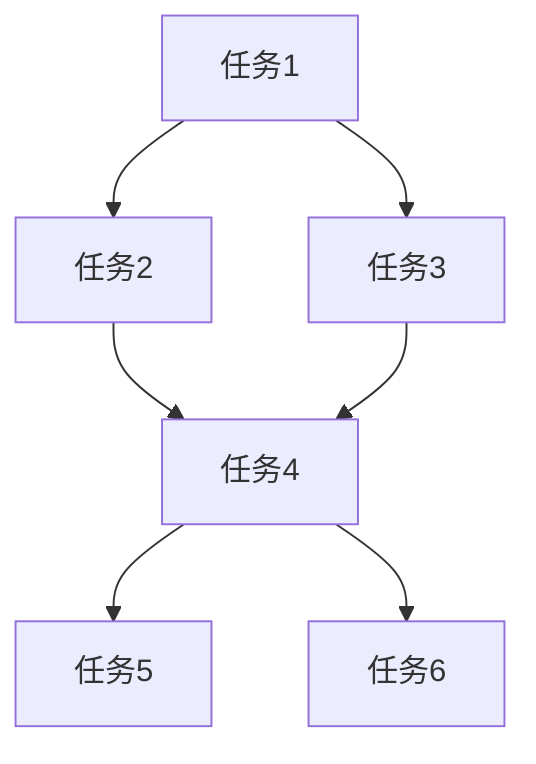

# 开发任务列表

## 项目信息
- **项目名称**: [项目名称]
- **创建日期**: [YYYY-MM-DD]
- **版本**: v1.0
- **负责人**: [姓名]

## 任务概览
- **总任务数**: N
- **已完成**: 0
- **进行中**: 0
- **待开始**: N
- **总估算**: X person-days

## 任务列表

### 阶段1: 核心功能 (优先级: High)

[ ] 任务1: [任务标题]
  - **描述**: [具体任务内容]
  - **输入**: [任务所需输入项]
  - **输出**: [预期结果]
  - **依赖**: [关联的前置任务]
  - **优先级**: High
  - **估算**: X person-days
  - **验收标准**:
    - [ ] 标准1
    - [ ] 标准2
    - [ ] 标准3
  - **状态**: 待开始
  - **负责人**: [待分配]

[ ] 任务2: [任务标题]
  - **描述**: [具体任务内容]
  - **输入**: [任务所需输入项]
  - **输出**: [预期结果]
  - **依赖**: [关联的前置任务]
  - **优先级**: High
  - **估算**: X person-days
  - **验收标准**:
    - [ ] 标准1
    - [ ] 标准2
    - [ ] 标准3
  - **状态**: 待开始
  - **负责人**: [待分配]

### 阶段2: 辅助功能 (优先级: Medium)

[ ] 任务3: [任务标题]
  - **描述**: [具体任务内容]
  - **输入**: [任务所需输入项]
  - **输出**: [预期结果]
  - **依赖**: [关联的前置任务]
  - **优先级**: Medium
  - **估算**: X person-days
  - **验收标准**:
    - [ ] 标准1
    - [ ] 标准2
    - [ ] 标准3
  - **状态**: 待开始
  - **负责人**: [待分配]

[ ] 任务4: [任务标题]
  - **描述**: [具体任务内容]
  - **输入**: [任务所需输入项]
  - **输出**: [预期结果]
  - **依赖**: [关联的前置任务]
  - **优先级**: Medium
  - **估算**: X person-days
  - **验收标准**:
    - [ ] 标准1
    - [ ] 标准2
    - [ ] 标准3
  - **状态**: 待开始
  - **负责人**: [待分配]

### 阶段3: 扩展功能 (优先级: Low)

[ ] 任务5: [任务标题]
  - **描述**: [具体任务内容]
  - **输入**: [任务所需输入项]
  - **输出**: [预期结果]
  - **依赖**: [关联的前置任务]
  - **优先级**: Low
  - **估算**: X person-days
  - **验收标准**:
    - [ ] 标准1
    - [ ] 标准2
    - [ ] 标准3
  - **状态**: 待开始
  - **负责人**: [待分配]

[ ] 任务6: [任务标题]
  - **描述**: [具体任务内容]
  - **输入**: [任务所需输入项]
  - **输出**: [预期结果]
  - **依赖**: [关联的前置任务]
  - **优先级**: Low
  - **估算**: X person-days
  - **验收标准**:
    - [ ] 标准1
    - [ ] 标准2
    - [ ] 标准3
  - **状态**: 待开始
  - **负责人**: [待分配]

## 依赖关系图



## 任务状态说明

- **待开始**: 任务已创建，等待分配和开始
- **进行中**: 任务正在执行中
- **待审核**: 任务已完成，等待代码审核
- **已完成**: 任务已完成并通过验收
- **已阻塞**: 任务因依赖未完成而阻塞
- **已取消**: 任务被取消

## 优先级说明

- **High**: 核心功能，必须在本次发布中完成
- **Medium**: 重要功能，计划在本次发布中完成
- **Low**: 增强功能，可以延期到后续版本

## 估算方法

### 1. 经验类比法
- 参考类似任务的完成时间
- 考虑复杂度差异

### 2. 三点估算法
- 乐观时间 (O)
- 最可能时间 (M)
- 悲观时间 (P)
- 估算 = (O + 4M + P) / 6

### 3. 功能点法
- 计算功能点数量
- 转换为人天数

## 工作量分布

```
核心功能: ████████████ 60% (X person-days)
辅助功能: ████████ 40% (X person-days)
扩展功能: █████ 25% (X person-days)
------------------------------------
总计: ████████████████████████████████ X person-days
```

## 风险评估

| 任务 | 风险类型 | 风险等级 | 应对措施 |
|------|----------|----------|----------|
| [任务名] | [风险类型] | High/Medium/Low | [应对措施] |
| [任务名] | [风险类型] | High/Medium/Low | [应对措施] |

## 验收标准模板

### 功能验收
- [ ] 功能按需求正常工作
- [ ] 所有用户场景测试通过
- [ ] 边界条件处理正确
- [ ] 错误信息友好明确

### 质量验收
- [ ] 代码符合规范
- [ ] 测试覆盖率 ≥ 80%
- [ ] 无严重代码异味
- [ ] 性能符合要求

### 文档验收
- [ ] API文档完整
- [ ] 代码注释清晰
- [ ] 部署文档更新
- [ ] 用户文档同步

## 任务跟踪

### 状态更新频率
- **每日**: 更新进行中任务状态
- **每周**: 回顾完成情况，调整计划
- **里程碑**: 评估整体进度

### 进度报告模板
```markdown
## 第X周进度报告

### 完成情况
- 已完成任务: X/N
- 完成率: X%
- 本周完成: [任务列表]

### 进行中任务
- 任务名: X%完成，预计完成时间 [日期]

### 阻塞任务
- 任务名: 等待 [依赖任务]

### 风险与问题
- [问题描述] - [应对措施]

### 下周计划
- [计划任务]
```

## Sprint计划

### Sprint 1 (YYYY-MM-DD ~ YYYY-MM-DD)
- [ ] 任务1
- [ ] 任务2
- [ ] 任务3
- **目标**: [Sprint目标]
- **预计工作量**: X person-days

### Sprint 2 (YYYY-MM-DD ~ YYYY-MM-DD)
- [ ] 任务4
- [ ] 任务5
- [ ] 任务6
- **目标**: [Sprint目标]
- **预计工作量**: X person-days

## 资源分配

| 团队成员 | 分配任务 | 工作量 | 技能匹配度 |
|----------|----------|--------|------------|
| [成员1] | [任务列表] | X% | High/Medium/Low |
| [成员2] | [任务列表] | X% | High/Medium/Low |
| [成员3] | [任务列表] | X% | High/Medium/Low |

## 质量门禁

### 提交前检查
- [ ] 代码自审完成
- [ ] 单元测试通过
- [ ] 测试覆盖率 ≥ 80%
- [ ] 无代码风格问题
- [ ] 无安全漏洞

### 审核检查
- [ ] 代码审查通过
- [ ] 集成测试通过
- [ ] 文档更新完成
- [ ] 验收测试通过

### 部署前检查
- [ ] 环境配置正确
- [ ] 监控告警配置
- [ ] 回滚方案准备
- [ ] 变更审批通过

## 变更记录

| 版本 | 日期 | 变更内容 | 责任人 |
|------|------|----------|--------|
| v1.0 | [日期] | 初始任务列表 | [姓名] |

**最后更新**: [YYYY-MM-DD HH:mm:ss]
